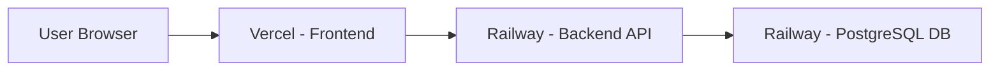

# 🚀 PlaytoPulse - Cloud Deployment Guide

This guide will walk you through deploying PlaytoPulse to the cloud using **Railway** (backend) and **Vercel** (frontend) - both offer generous free tiers!

---

## 📋 Prerequisites

- GitHub account (for connecting to Railway and Vercel)
- Git installed locally
- Your project code ready to push

---

## 🎯 Deployment Overview



**Architecture:**
- **Frontend**: React app hosted on Vercel (CDN-distributed)
- **Backend**: Django API hosted on Railway
- **Database**: PostgreSQL hosted on Railway

---

## 🔧 Part 1: Deploy Backend to Railway

### Step 1: Prepare Your Code

Your backend is already configured! We've added:
- ✅ `Procfile` - Tells Railway how to run your app
- ✅ `runtime.txt` - Specifies Python version
- ✅ Updated `requirements.txt` - Production dependencies
- ✅ Updated `settings.py` - Environment variable support

### Step 2: Push to GitHub

```bash
# Navigate to your project root
cd c:\Users\NAGENDRA\Desktop\project

# Initialize git (if not already done)
git init

# Create .gitignore
echo "venv/" >> .gitignore
echo "*.pyc" >> .gitignore
echo "__pycache__/" >> .gitignore
echo "db.sqlite3" >> .gitignore
echo ".env" >> .gitignore
echo "node_modules/" >> .gitignore
echo "dist/" >> .gitignore
echo ".DS_Store" >> .gitignore

# Add all files
git add .

# Commit
git commit -m "Initial commit - PlaytoPulse ready for deployment"

# Create a new repository on GitHub, then:
git remote add origin https://github.com/YOUR_USERNAME/playtopulse.git
git branch -M main
git push -u origin main
```

### Step 3: Deploy to Railway

1. **Go to [Railway.app](https://railway.app/)** and sign in with GitHub

2. **Create New Project**:
   - Click "New Project"
   - Select "Deploy from GitHub repo"
   - Choose your `playtopulse` repository
   - Railway will auto-detect it's a Django app

3. **Add PostgreSQL Database**:
   - In your project dashboard, click "+ New"
   - Select "Database" → "PostgreSQL"
   - Railway will automatically create a `DATABASE_URL` environment variable

4. **Configure Environment Variables**:
   - Click on your Django service
   - Go to "Variables" tab
   - Add these variables:

   ```
   SECRET_KEY=your-super-secret-key-change-this-to-something-random
   DEBUG=False
   ALLOWED_HOSTS=.railway.app
   FRONTEND_URL=https://your-app.vercel.app
   ```

   > **Note**: Railway automatically provides `DATABASE_URL` - don't add it manually!

5. **Set Root Directory** (Important!):
   - Go to "Settings" tab
   - Under "Build & Deploy", set:
     - **Root Directory**: `backend`
     - **Build Command**: `pip install -r requirements.txt && python manage.py collectstatic --noinput`
     - **Start Command**: `gunicorn reddit_clone.wsgi --log-file -`

6. **Deploy**:
   - Click "Deploy" or push to GitHub (auto-deploys)
   - Wait for build to complete (~2-3 minutes)

7. **Run Migrations**:
   - Once deployed, go to your service
   - Click on "Deployments" → "View Logs"
   - In the top right, click "⋮" → "Run Command"
   - Run: `python manage.py migrate`
   - Run: `python manage.py createsuperuser` (optional, for admin access)

8. **Get Your Backend URL**:
   - Go to "Settings" → "Networking"
   - Click "Generate Domain"
   - Copy the URL (e.g., `https://playtopulse-production.up.railway.app`)

---

## 🎨 Part 2: Deploy Frontend to Vercel

### Step 1: Configure Environment Variable

Create a `.env` file in the `frontend` directory:

```bash
cd frontend
echo "VITE_API_URL=https://your-backend.railway.app/api" > .env
```

Replace `your-backend.railway.app` with your actual Railway backend URL.

### Step 2: Test Build Locally (Optional)

```bash
npm run build
```

This should create a `dist` folder without errors.

### Step 3: Deploy to Vercel

1. **Go to [Vercel.com](https://vercel.com/)** and sign in with GitHub

2. **Import Project**:
   - Click "Add New..." → "Project"
   - Select your `playtopulse` repository
   - Vercel will auto-detect it's a Vite app

3. **Configure Project**:
   - **Framework Preset**: Vite
   - **Root Directory**: `frontend`
   - **Build Command**: `npm run build`
   - **Output Directory**: `dist`

4. **Add Environment Variable**:
   - Under "Environment Variables", add:
     ```
     VITE_API_URL = https://your-backend.railway.app/api
     ```
   - Replace with your actual Railway backend URL

5. **Deploy**:
   - Click "Deploy"
   - Wait for build (~1-2 minutes)
   - Vercel will give you a URL (e.g., `https://playtopulse.vercel.app`)

---

## 🔗 Part 3: Connect Frontend & Backend

### Update Backend CORS Settings

1. Go back to **Railway**
2. Update the `FRONTEND_URL` environment variable:
   ```
   FRONTEND_URL=https://playtopulse.vercel.app
   ```
   (Use your actual Vercel URL)

3. Railway will auto-redeploy with the new settings

### Test Your Deployment

1. Visit your Vercel URL: `https://playtopulse.vercel.app`
2. You should see the PlaytoPulse interface!
3. Try creating a post, commenting, and liking

---

## 🧪 Part 4: Add Test Data (Optional)

To populate your production database with test data:

1. Go to Railway → Your Django service → "⋮" → "Run Command"
2. Upload your `create_test_data.py` file (or copy-paste the code)
3. Run: `python create_test_data.py`

---

## 🐛 Troubleshooting

### Backend Issues

**Problem**: "Application failed to respond"
- **Solution**: Check Railway logs for errors
- Ensure `Procfile` is in the `backend` directory
- Verify `ALLOWED_HOSTS` includes `.railway.app`

**Problem**: "Database connection error"
- **Solution**: Ensure PostgreSQL is added to your Railway project
- Check that `DATABASE_URL` is automatically set

**Problem**: "Static files not loading"
- **Solution**: Run `python manage.py collectstatic --noinput` in Railway console

### Frontend Issues

**Problem**: "API calls failing (CORS errors)"
- **Solution**: Update `FRONTEND_URL` in Railway to match your Vercel URL
- Ensure `VITE_API_URL` in Vercel points to your Railway backend

**Problem**: "Environment variable not working"
- **Solution**: Vercel requires `VITE_` prefix for Vite env vars
- Redeploy after adding environment variables

---

## 📊 Monitoring & Logs

### Railway (Backend)
- **Logs**: Railway Dashboard → Your Service → "Deployments" → "View Logs"
- **Metrics**: Railway Dashboard → "Metrics" tab
- **Database**: Railway Dashboard → PostgreSQL service → "Data" tab

### Vercel (Frontend)
- **Logs**: Vercel Dashboard → Your Project → "Deployments" → Click deployment → "Logs"
- **Analytics**: Vercel Dashboard → "Analytics" tab (free tier has basic analytics)

---

## 💰 Free Tier Limits

### Railway
- **Free Plan**: $5 credit/month (enough for small projects)
- **Includes**: 512MB RAM, shared CPU, PostgreSQL database
- **Auto-sleep**: No (stays active 24/7)

### Vercel
- **Hobby Plan**: Free forever
- **Includes**: 100GB bandwidth/month, unlimited deployments
- **Auto-deploy**: Yes (on every git push)

---

## 🔐 Security Checklist

Before going live, ensure:

- ✅ `DEBUG=False` in production
- ✅ `SECRET_KEY` is unique and secret (not the default one)
- ✅ `ALLOWED_HOSTS` is properly configured
- ✅ Database credentials are not hardcoded
- ✅ `.env` files are in `.gitignore`
- ✅ CORS is configured to only allow your frontend domain

---

## 🚀 Continuous Deployment

Both Railway and Vercel support **automatic deployments**:

1. Push code to GitHub:
   ```bash
   git add .
   git commit -m "Update feature"
   git push
   ```

2. Railway and Vercel will automatically:
   - Detect the push
   - Build your code
   - Deploy to production
   - No manual intervention needed! 🎉

---

## 📝 Quick Reference

| Service | URL | Purpose |
|---------|-----|---------|
| **Railway Backend** | `https://your-app.railway.app` | Django API + PostgreSQL |
| **Vercel Frontend** | `https://your-app.vercel.app` | React UI |
| **Railway Dashboard** | [railway.app/dashboard](https://railway.app/dashboard) | Manage backend |
| **Vercel Dashboard** | [vercel.com/dashboard](https://vercel.com/dashboard) | Manage frontend |

---

## 🎯 Next Steps

After deployment:

1. **Custom Domain** (Optional):
   - Railway: Settings → Networking → Custom Domain
   - Vercel: Settings → Domains → Add Domain

2. **Enable Authentication**:
   - Implement JWT tokens for user login
   - Update `REST_FRAMEWORK` settings

3. **Add Monitoring**:
   - Sentry for error tracking
   - Google Analytics for user metrics

4. **Performance Optimization**:
   - Enable Redis caching on Railway
   - Optimize database queries
   - Add CDN for static assets

---

## 🆘 Need Help?

- **Railway Docs**: [docs.railway.app](https://docs.railway.app)
- **Vercel Docs**: [vercel.com/docs](https://vercel.com/docs)
- **Django Deployment**: [docs.djangoproject.com/en/4.2/howto/deployment/](https://docs.djangoproject.com/en/4.2/howto/deployment/)

---

**Congratulations! 🎉 Your PlaytoPulse app is now live on the internet!**

Share your deployment URL and show off your work! 🚀
